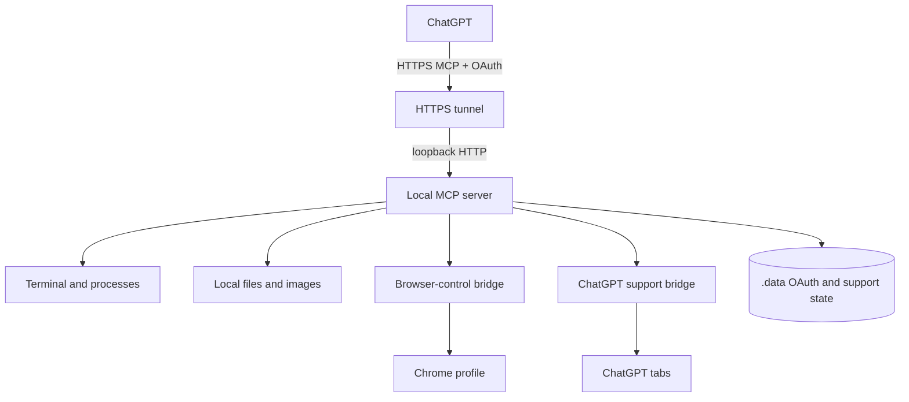
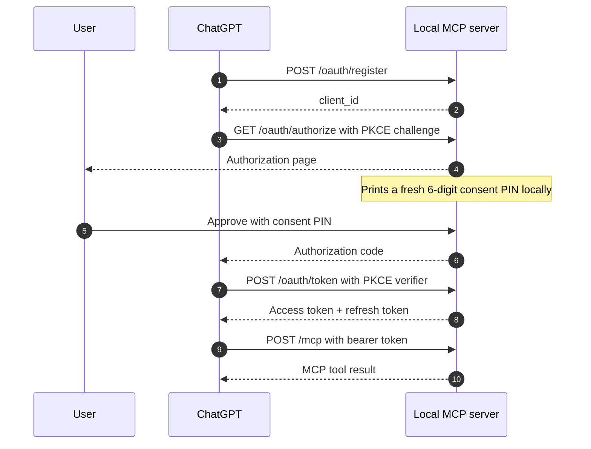

# Local Computer Control MCP Server

Local Computer Control is a local Model Context Protocol server that lets an authorized ChatGPT session operate a developer machine. It exposes terminal, process, file, image, browser, thread-sync, reviewer, and RALPH capabilities while keeping the MCP server and browser bridges under the local user's control.

The server is designed for powerful local automation. Tool calls run with the permissions of the user who started the server, so access is protected by OAuth, a local consent PIN, loopback-only defaults, scoped browser bridges, and revocable grants.



## What the server provides

### Local computer tools

The core MCP server always exposes these tools:

- `terminal` runs one shell command. The default shell is PowerShell on Windows, `/bin/bash` on macOS, and `/bin/sh` on Linux. Calls have a 60-second maximum timeout.
- `analyze_image` reads a local PNG, JPEG, WebP, or GIF and returns native MCP image content. Images are limited to 20 MiB.
- `save_chatgpt_file` saves a file already present in the ChatGPT conversation to the local filesystem. Downloads are bounded by size, timeout, and redirect limits.
- `start_process` starts an executable with an argument array instead of shell interpolation. It can return immediately or wait up to 60 seconds for completion.

### Browser-control tools

When `BROWSER_BRIDGE_ENABLED` is not `false`, the server also exposes:

- `browser_tabs` lists tabs in the user's real Chrome profile.
- `browser_claim` takes control of one existing user tab after checking its tab ID, title, and URL.
- `browser_release` ends control. It closes an agent-created tab and leaves a claimed user tab open.
- `browser_open` opens and controls a new tab or window and can start Chrome when the bridge is disconnected.
- `browser_snapshot` returns visible text, fresh element references, accessibility information, diagnostics, and an optional screenshot.
- `browser_action` navigates, clicks, types, presses keys, scrolls, waits, activates, reloads, or closes a controlled tab.
- `browser_upload` uploads local files through a file input or intercepted file chooser.
- `browser_download` triggers, lists, waits for, or cancels browser downloads.
- `browser_evaluate` evaluates JavaScript through CDP for development and debugging cases where structured actions are not enough.

A normal browser workflow is `browser_open`, or `browser_tabs` followed by `browser_claim`, then `browser_snapshot` and actions, and finally `browser_release`.

### ChatGPT thread and review tools

When `THREAD_SYNC_ENABLED` is not `false`, the server exposes:

- `sync_current_thread` binds the current MCP session to its conversation once. Repeated calls reuse the binding.
- `get_current_thread_url` finishes a pending binding without opening another widget.
- `start_reviewer` starts one independent review for a synced parent and returns the exact ChatGPT review-thread URL. The implementer ends its turn immediately after handoff.
- `list_reviewers` returns a snapshot of reviews owned by the current synced parent, including each known review-thread URL. It is for inspection and recovery, not completion polling.
- `review_done` stores the reviewer's complete report. The service waits for reviewer idle before waking the parent with the report path.
- `start_thread` creates a separate conversation only on an explicit user request. It adds no review job or callback.
- `send_thread_message` sends an explicitly requested message to an existing conversation.

Generic delegation tools are not exposed to ChatGPT. Reviewers reuse the existing local job machinery internally, but the model-facing API and MCP App expose only reviewer concepts. A parent can have one unfinished review, including startup and report delivery. Different user-started parents remain independent. Nested reviewers are rejected. Cancellation and failed-delivery recovery remain operator actions in the Support extension.

The Reviewer project setting chooses where reviews start, with chatgpt.com as the default. New report state lives under `<DATA_DIR>/reviews/`. On first open, legacy `<DATA_DIR>/subagents/` jobs and report files are copied forward and rewritten to the reviewer directory. The historical `subagentProjectUrl` setting key remains readable for compatibility.

Repeated identical review briefs reuse their saved job across restarts. Include the current PR head SHA in each brief so a review of changed code is a new assignment. An uncertain startup keeps its reservation. Inspect it in the extension before cancelling. Known reviewers are stopped before cancellation releases the reservation. Unknown startups require confirmation that any untracked reviewer has stopped. Late reports from cancelled jobs are rejected.

## OAuth and MCP flow

ChatGPT authenticates with OAuth 2.0 and PKCE. The server uses stateless MCP HTTP requests, so every `/mcp` request must carry a valid access token.



The default access-token lifetime is 600 seconds. Refresh tokens rotate on use. The server keeps a bounded set of parallel refresh-token branches per grant so concurrent ChatGPT requests do not invalidate each other unnecessarily.

## Install and configure

### Prerequisites

- Node.js 24 or newer is recommended. The repository intentionally has no `.nvmrc` or `engines` major-version pin.
- pnpm 11.8.0 is the package-manager version declared by `package.json`.
- PowerShell is required for the included management scripts. On macOS and Linux, use `pwsh` for those scripts.
- A public HTTPS tunnel such as ngrok or Cloudflare Tunnel is required when ChatGPT needs to reach the local MCP endpoint.
- Google Chrome is required for the general browser-control bridge.

### Install dependencies

```powershell
pnpm install --frozen-lockfile
```

### Create `.env`

```powershell
Copy-Item .env.example .env
```

The main settings are:

```env
PORT=6000
HOST=localhost

PUBLIC_BASE_URL=https://mcp.example.com
MCP_PUBLIC_URL=https://mcp.example.com/mcp
AUTH_ISSUER=https://mcp.example.com

ALLOWED_REDIRECT_URIS=https://chatgpt.com/connector/oauth/your-connector-id
REQUIRE_EXACT_REDIRECT_URIS=true
ALLOW_NON_LOOPBACK_BIND=false

BROWSER_BRIDGE_ENABLED=true
# BROWSER_BRIDGE_PORT=6001

THREAD_SYNC_ENABLED=true
# THREAD_SYNC_PORT=6002

# Required only when normal RALPH classification is used.
OPENAI_API_KEY=
# RALPH_MODEL=gpt-5.6-terra
```

Use `.env.example` as the complete reference. It also documents file-download limits, OAuth storage, terminal overrides, browser executable and profile overrides, token settings, and CORS settings.

`PUBLIC_BASE_URL`, `MCP_PUBLIC_URL`, and `AUTH_ISSUER` must use the same origin. For a public deployment with exact redirect matching enabled, `ALLOWED_REDIRECT_URIS` must contain the exact ChatGPT OAuth callback URI.

Keep `HOST` on loopback. A public tunnel should forward to the local listener instead of exposing the Node process directly.

### Harden local state

```powershell
pnpm harden
```

The hardening script restricts access to `.env` and `.data`. On Windows it applies ACLs. On macOS and Linux it uses the available PowerShell management path and filesystem permissions.

### Build and start

```powershell
pnpm build
pnpm start
```

For development:

```powershell
pnpm dev
```

## Set up browser control

The server generates a private unpacked extension under `.data/browser-extension`. The generated copy contains the loopback bridge endpoint and a random bridge token, so do not load the source `browser-extension` directory directly.

1. Start Local Computer Control once so `.data/browser-extension` exists.
2. Open `chrome://extensions` in the Chrome profile that ChatGPT should control.
3. Enable **Developer mode**.
4. Click **Load unpacked** and select `.data/browser-extension`.
5. Confirm that the extension connects to the local bridge.

The browser bridge listens only on loopback. It is separate from the public MCP listener.

`browser_open` can start Chrome when the bridge is disconnected. The extension must already be installed in the profile that Chrome opens. Use `BROWSER_EXECUTABLE_PATH`, `BROWSER_PROFILE_DIRECTORY`, and `BROWSER_USER_DATA_DIRECTORY` when the default installation or profile is not the one you want.

Controlled pages show visible control indicators. Element references returned by `browser_snapshot` are valid only for the latest page state. Navigation or document changes invalidate stale references.

## Set up the Local Codex Support extension

The support extension is separate from the general browser-control extension. It handles Thread Sync, RALPH, and agent thread messaging.

Generate the private extension:

```powershell
pnpm support:prepare
```

This writes `.data/support-extension` with the local support endpoint and private token. The support listener defaults to `127.0.0.1:6002`. Set `THREAD_SYNC_PORT` to change it or `THREAD_SYNC_ENABLED=false` to disable the feature.

Load `.data/support-extension` as an unpacked extension. Do not load the source `support-extension` directory.

The popup lets you configure four browser responsibilities:

- Thread sync. This can be enabled in more than one compatible browser because binding is idempotent.
- Automation browser executor. Enable this only in the Chrome automation profile. It opens or reuses persistent thread tabs for active registered conversations.
- RALPH automation. Normally enable this in only one browser.
- Agent thread messaging. Normally enable this in only one browser.

Automation commands are claimed atomically by one enabled browser instance. This prevents two support extensions from executing the same queued command.

See [support-extension/README.md](support-extension/README.md) for the exact support-extension behavior.

## Reviewer result delivery

`sync_current_thread` is on demand, not a conversation-start requirement. Call it before an operation that needs the current conversation binding; `start_reviewer` specifically requires the parent to be bound first. If it reports `syncing`, immediately finish the one-time handshake with `get_current_thread_url` before that binding-dependent operation.

Review completion is explicit. Writing a report file alone does not complete a job. `review_done` stores the report atomically; duplicate submissions keep the first report. The service checks completed jobs every five seconds, waits for reviewer idle, then sends the parent its report path. It does not scan unfinished result files. Failed delivery uses bounded exponential backoff. The extension shows the error and offers Retry parent wake-up. Parents remain paused until delivery succeeds.

Visible recognized ChatGPT rate-limit notices defer queued messages for 10 minutes. Deferred sends drain at least five seconds apart. Stop commands remain available. This reduces burst traffic but cannot guarantee that account rate limits will never be reached. Cooldown is process-local.

Transport retries are deduplicated internally. After an uncertain new logical send, inspect the target before sending again.

## RALPH

RALPH is the support-extension continuation runtime. It tracks registered ChatGPT threads in `.data/ralph.json` and shows them in the support-extension popup. The Reviews section shows each known review's exact ChatGPT URL and opens that conversation directly.

Normal project threads are registered only when their project is in the RALPH project allowlist. Manually registered threads and reviewer threads remain registered independently of that allowlist.

Thread observation does not grant automation ownership. The backend prepares only active registered RALPH threads. Ordinary threads and completed threads do not cause Chrome tabs to open merely because Helium observes them. Explicit reviewer and messaging commands can still open their target conversation. Chrome reuses matching tabs, preserves active automation tabs, and closes only automation-owned tabs ten minutes after completion.

External composer activity records a persistent conversation revision for registered threads. Before its next operation, Chrome refreshes an existing idle tab only if that revision changed. Running tabs defer the refresh. Repeated timer cycles, route observations, and title changes do not trigger refreshes.

RALPH has two modes:

- `normal` checks active threads repeatedly. The default interval is 180 seconds (3 minutes), with a minimum configurable interval of 120 seconds. Registration, running/loading observations, and continuations all use that interval. `loading` and `running` never call the classifier. Once a turn is settled and idle, a worked duration at or below 1200 seconds (20 minutes), or an unavailable duration, marks the thread complete locally. Only a worked duration strictly above 20 minutes reaches the OpenAI completion classifier.
- `continuous` is explicit. It uses the same repeated inspection loop but skips completion classification and sends a fixed continuation instruction whenever the thread is settled, idle, and due. It stays active until the user stops continuous mode or marks the thread complete.

An ordinary idle turn keeps continuous mode enabled. Explicit COMPLETE or BLOCKED checkpoints stop scheduled continuation. Use **Stop continuous** in the support-extension popup to return that thread to normal RALPH behavior, or **Mark complete** to stop scheduled RALPH checks for the thread.

Normal-mode classification uses `OPENAI_API_KEY` and defaults to `gpt-5.6-terra`. Classification requests and results are written to `.data/ralph-openai.log`; the API key is not written to that log.

## Connect ChatGPT

Expose the local MCP listener through an HTTPS tunnel, then configure the ChatGPT connector to use:

- MCP URL: `https://your-domain.example/mcp`
- Authorization URL: `https://your-domain.example/oauth/authorize`
- Token URL: `https://your-domain.example/oauth/token`
- Scope: `mcp:control`, unless `REQUIRED_SCOPE` is changed

During authorization, read the fresh six-digit consent PIN from the local server terminal and enter it in the authorization page.

## Security model

The important boundaries are:

- The main server binds to loopback unless `ALLOW_NON_LOOPBACK_BIND=true` is set.
- OAuth uses PKCE and a fresh local six-digit consent PIN for each authorization request.
- Access tokens are short-lived. Refresh tokens rotate, and stored refresh tokens are hashed.
- Public deployments can require exact OAuth redirect URIs.
- The browser-control bridge and ChatGPT support bridge use separate private loopback credentials stored under `.data`.
- Browser tab ownership is explicit. Existing tabs must be claimed from a fresh `browser_tabs` listing.
- Browser element references become stale when the page state changes.
- `start_process` executes an executable directly instead of interpolating a shell command.
- Child processes are launched with a restricted environment rather than inheriting authentication secrets.
- Rate limits protect sensitive OAuth and support endpoints.

Treat `.env` and `.data` as private host state.

## Revoke access

Run the interactive revocation tool:

```powershell
pnpm revoke
```

Examples:

```powershell
pnpm revoke -- -ClientId local_example
pnpm revoke -- -All
pnpm revoke -- -All -RemoveClients
```

## Verification

Type-check the project:

```powershell
pnpm check
```

Run the OAuth and tool smoke test against a running instance:

```powershell
pnpm smoke
```

Run the security regression suite:

```powershell
pnpm security-test
```

Run browser bridge tests:

```powershell
pnpm browser-test
```

Run Thread Sync, support extension, reviewer, and RALPH tests:

```powershell
pnpm thread-sync-test
```

## Design docs

- [Local Codex Support extension](support-extension/README.md)
- [ADR 0001: explicit ChatGPT URL binding and support automation](docs/adr/0001-explicit-chatgpt-url-binding.md)

## License

`package.json` declares the project license as MIT.


## Sequential engineering workflow

The shared engineering-loop skill implements and tests the requested behavior, publishes or updates the PR, then calls `start_reviewer` as its final tool call. The reviewer posts one GitHub COMMENT review for the exact PR head and calls `review_done`. The implementer reads that report, fixes supported defects, records reasons for rejected suggestions, tests, and pushes. Meaningful fixes receive another sequential review. Completion requires resolved material findings and passing required CI for the current head.

The service does not forcibly stop the implementer's live MCP call. The tool response and skill require it to end its turn after handoff. RALPH enforces the pause for automatic continuation. User-started tasks are not serialized account-wide.

Unfinished turns save a checkpoint and end with a status line:

| Final line | RALPH action |
| --- | --- |
| `RALPH_STATUS: CONTINUE` | Resume the saved task once for this observed turn. |
| `RALPH_STATUS: WAIT_CI` | Wait five minutes before resuming for a CI snapshot. |
| `RALPH_STATUS: BLOCKED` | Stop automatic continuation for a reported dependency. |
| `RALPH_STATUS: COMPLETE` | Stop automatic continuation after verification. |

These explicit checkpoints bypass the worked-time classifier. A pending review takes precedence over them. Wait state and the last resumed checkpoint survive service restarts. Ordinary unmarked turns retain the existing RALPH behavior.
