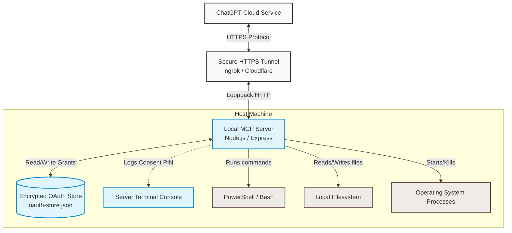
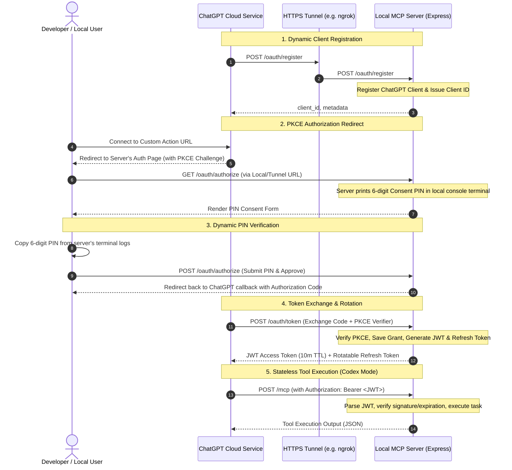

# Local Computer Control MCP Server

A hardened, production-ready **Model Context Protocol (MCP) server** that enables an authorized ChatGPT session to act as a **local "Codex" environment**, allowing it to securely control a Windows or macOS machine through terminal commands, filesystem operations, and process management.

The server is designed with a defense-in-depth security model to ensure that powerful local capabilities (which run with the permissions of the host user) are only accessible to an explicitly approved, authenticated, and revocable ChatGPT connection.



---

## 🔑 How It Works: The OAuth + MCP Flow

ChatGPT uses **OAuth 2.0 with PKCE (Proof Key for Code Exchange)** to securely authenticate and maintain connection persistence. The flow behaves as follows:



### 1. Registration & Setup
The server exposes an RFC 7591 compliant dynamic client registration endpoint (`/oauth/register`). ChatGPT registers itself, obtaining a unique client ID.

### 2. Authorization & The Local PIN Gate
To connect, ChatGPT redirects your browser to the authorization endpoint (`/oauth/authorize`). Instead of using static credentials, the server **dynamically generates a random 6-digit Consent PIN** and prints it to the local terminal. You must enter this PIN in the browser form to approve the connection. This ensures only someone with access to the host machine's terminal can grant access.

### 3. JWT-Based Stateless Tool Execution
Once authorized, ChatGPT obtains a short-lived JSON Web Token (JWT) access token (10-minute lifetime by default). Every MCP tool call is transmitted via stateless HTTP POST request to the `/mcp` endpoint and must include a valid bearer token.

### 4. Refresh Token Rotation (RTR)
When the access token expires, ChatGPT automatically uses the refresh token to request a new set of tokens. The server rotates refresh tokens upon use and supports **bounded parallel branch rotation** (up to 64 active keys per grant), ensuring concurrent ChatGPT queries do not accidentally invalidate each other.

---

## 🛠️ Included Tools

Once connected, ChatGPT can call the following tools to inspect, modify, and build local code:

*   **`terminal`**: Run terminal commands using PowerShell on Windows, `/bin/bash` on macOS, and `/bin/sh` on Linux.
    *   *Features*: Bounded output, a 60-second maximum timeout, and platform-aware process termination.
*   **`read_text_file`**: Read up to 5 MiB of a UTF-8 file.
    *   *Features*: Bounded disk I/O to prevent memory exhaustion from loading large files.
*   **`analyze_image`**: Load a local PNG, JPEG, WebP, or GIF and return it as native MCP image content so ChatGPT can visually inspect it.
    *   *Features*: Detects the image type from file bytes rather than trusting the extension and rejects images larger than 20 MiB.
*   **`save_chatgpt_file`**: Save a file already present in the ChatGPT conversation (including a ChatGPT-generated image) directly to a local path.
    *   *Features*: Uses ChatGPT `openai/fileParams`, bounded HTTPS downloads, redirect limits, optional parent-directory creation, and overwrite control.
*   **`write_text_file`**: Create or overwrite up to 5 MiB of UTF-8 text.
*   **`list_directory`**: List up to 1,000 directory entries.
    *   *Features*: Bounded concurrent filesystem calls for listing directory metadata.
*   **`start_process`**: Start an executable with strict argument-array semantics (no shell interpolation), optionally waiting for completion.
*   **`browser_status`**: Check whether the local Chrome extension bridge is connected and get the generated extension directory.
*   **`browser_tabs`**: List tabs from the user's real Chrome profile with ownership state.
*   **`browser_tab`**: Claim or release user tabs, mark handoffs or deliverables, and clean up agent-created tabs.
*   **`browser_open`**: Open an agent-owned Chrome tab or window and attach automation.
*   **`browser_snapshot`**: Inspect a tab with visible text, fresh element refs, related popups, a compact accessibility tree, console/network diagnostics, and an optional PNG screenshot.
*   **`browser_action`**: Navigate, go back or forward, reload, click, double-click, type, press keys, scroll, wait, activate, or close a tab. Every action returns a fresh semantic snapshot.
*   **`browser_upload`**: Upload local files through a file input or intercepted browser file chooser.
*   **`browser_download`**: Trigger, list, wait for, or cancel downloads and report their local file paths.
*   **`browser_clipboard`**: Read or write plain text through Chrome.
*   **`browser_evaluate`**: Run JavaScript through CDP for development/debugging cases that structured browser actions cannot cover.

---

## 📦 Installation & Setup

### Prerequisites
*   **Node.js**: `v22.0.0` or higher (under `v23`).
*   **pnpm**: Version 9 or higher.
*   **PowerShell**: Windows PowerShell on Windows, or PowerShell 7 (`pwsh`) on macOS, for the included management scripts. MCP terminal commands use Bash on macOS.
*   **A Public Tunnel**: `ngrok`, `cloudflared`, or similar.

### Step 1: Install Dependencies
```powershell
pnpm install --frozen-lockfile
```

### Step 2: Configure Environment Variables
Create a `.env` file in the root directory. You can copy the template from `.env.example`:
```powershell
Copy-Item .env.example .env
```

Edit your `.env` file to match your setup:
```env
PORT=6000
HOST=localhost

# Chrome bridge stays loopback-only and is not sent through the public tunnel.
BROWSER_BRIDGE_ENABLED=true
# BROWSER_BRIDGE_PORT=6001 # defaults to PORT + 1

# Set these to your public HTTPS tunnel domain (e.g. ngrok or cloudflare tunnel)
PUBLIC_BASE_URL=https://mcp.yourtunnel.ngrok-free.app
MCP_PUBLIC_URL=https://mcp.yourtunnel.ngrok-free.app/mcp
AUTH_ISSUER=https://mcp.yourtunnel.ngrok-free.app

# Lockdown callback URIs to match ChatGPT (obtain this from your Custom Action registration page)
ALLOWED_REDIRECT_URIS=https://chatgpt.com/connector/oauth/your-unique-connector-id
REQUIRE_EXACT_REDIRECT_URIS=true

# Security defaults
ALLOW_NON_LOOPBACK_BIND=false
ACCESS_TOKEN_TTL_SECONDS=600
REFRESH_ROTATION_GRACE_SECONDS=60
MAX_REFRESH_TOKENS_PER_GRANT=64
# Optional management-script override; normally leave unset.
# POWERSHELL_EXECUTABLE=pwsh

# Optional MCP terminal override. macOS defaults to /bin/bash.
# TERMINAL_EXECUTABLE=/bin/bash
```

> [!IMPORTANT]  
> Because ChatGPT is a cloud-based service, it **cannot** talk to `localhost` directly. You must configure a tunnel (e.g. `ngrok http 6000`) and set the `PUBLIC_BASE_URL`, `MCP_PUBLIC_URL`, and `AUTH_ISSUER` variables to the tunnel's HTTPS URL.

### Step 3: Harden File Permissions
Run the hardening script to restrict access to the `.env` configuration file and `.data/` directory. On Windows it applies ACLs; on macOS it removes group and other permissions:
```powershell
pnpm run harden
```

### Step 4: Build and Start the Server
Build the TypeScript source and run the production server:
```powershell
pnpm run build
pnpm start
```
Alternatively, for development mode:
```powershell
pnpm dev
```

### Step 5: Load the Chrome bridge extension

The server creates a private unpacked extension at `.data/browser-extension` and prints the exact path at startup. The generated folder contains a loopback WebSocket address and a random 256-bit bridge token stored under `.data`; it is intentionally excluded from Git.

1. Open `chrome://extensions` in the Chrome profile you want ChatGPT to control.
2. Enable **Developer mode**.
3. Click **Load unpacked** and choose the generated `.data/browser-extension` directory.
4. The extension badge shows **ON** when it is connected to the local MCP server.

This is a one-time setup for that Chrome profile. The bridge talks only to `127.0.0.1`; the public HTTPS tunnel is used only for ChatGPT-to-MCP traffic.

---

## 🔗 Connecting ChatGPT

1.  Create a new **Custom GPT** or **Custom Action** in ChatGPT.
2.  Add the MCP Schema metadata or set the import URL to:
    ```text
    https://your-tunnel-domain.ngrok-free.app/mcp
    ```
3.  Choose **OAuth** as the authentication type.
4.  Configure the OAuth details:
    *   **Client ID**: (Will be created dynamically during registration, or copy the values if using static options)
    *   **Authorization URL**: `https://your-tunnel-domain.ngrok-free.app/oauth/authorize`
    *   **Token URL**: `https://your-tunnel-domain.ngrok-free.app/oauth/token`
    *   **Scope**: `mcp:control`
5.  Trigger the auth flow in ChatGPT. Look at your local terminal console where the server is running to get your **6-digit Consent PIN**, input it on the webpage, and approve!

---

## 🛡️ Security Hardening Details

*   **🔒 Strict Binds**: The server binds to loopback (`localhost`) by default, preventing local network exposure unless `ALLOW_NON_LOOPBACK_BIND=true` is set.
*   **🔐 File Permission Isolation**: `pnpm run harden` applies Windows ACLs or macOS permissions to protect signing keys and token caches.
*   **🙅 Open Redirect Protection**: The server blocks dynamic client registrations from attempting open redirection. Redirect URIs must match exact registered patterns.
*   **⏳ Short-Lived JWTs**: Access tokens expire in 10 minutes. Token validity is checked against a cryptographic signature (RS256) on every MCP request.
*   **🌀 Hash-based Token Storage**: Refresh tokens are stored in the database as SHA-256 hashes rather than plaintext.
*   **🚫 Sandboxed Child Processes**: Launched commands and child processes do not inherit sensitive environment variables like authorization credentials.
*   **📈 Rate Limiting**: Protection against brute-force attempts on critical endpoints (token exchange, authorization code creation, and client registration).
*   **Browser Bridge Isolation**: Chrome connects only to a loopback WebSocket protected by a random token stored in `.data`. The extension never connects to the public MCP tunnel.
*   **Visible Browser Control**: Controlled tabs show a blue viewport aura and an animated click pointer. The overlay cannot receive input and disappears when control is released.
*   **Stale Element Protection**: Browser element refs are scoped to the latest snapshot and page epoch. Navigation or document changes invalidate old refs instead of clicking a recycled target.
*   **Semantic Browser State**: Automation prefers Playwright locator semantics plus Chrome's accessibility tree. Coordinates are only a fallback for visual/canvas targets.
*   **Tab Ownership**: Existing user tabs require a fresh title-and-URL-checked claim. Popups inherit agent ownership from their opener. Cleanup closes unmarked agent tabs and releases unmarked user tabs without closing them.

---

## 🧹 Managing and Revoking Access

To audit, list, or revoke registered clients and active OAuth grants:

```powershell
# Interactive list of clients and grants
pnpm revoke

# Revoke all grants for a specific client
pnpm revoke -- -ClientId local_example

# Revoke all grants and logouts
pnpm revoke -- -All

# Remove client registrations alongside grants
pnpm revoke -- -All -RemoveClients
```

---

## 🧪 Testing & Verification

### Smoke Test
Verify PKCE authentication, client registration, access token expiration, token rotation, and tools behavior on a running instance. The script prompts for the per-request consent PIN printed by the running server:
```powershell
pnpm smoke
```

### Security Regression Suite
Ensure the server maintains security boundaries, prevents open redirects, respects CORS boundaries, and properly authenticates request payloads:
```powershell
pnpm security-test
```

## 📄 License
This project is licensed under the [MIT License](LICENSE).
