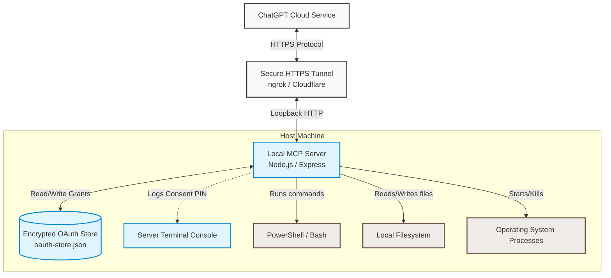
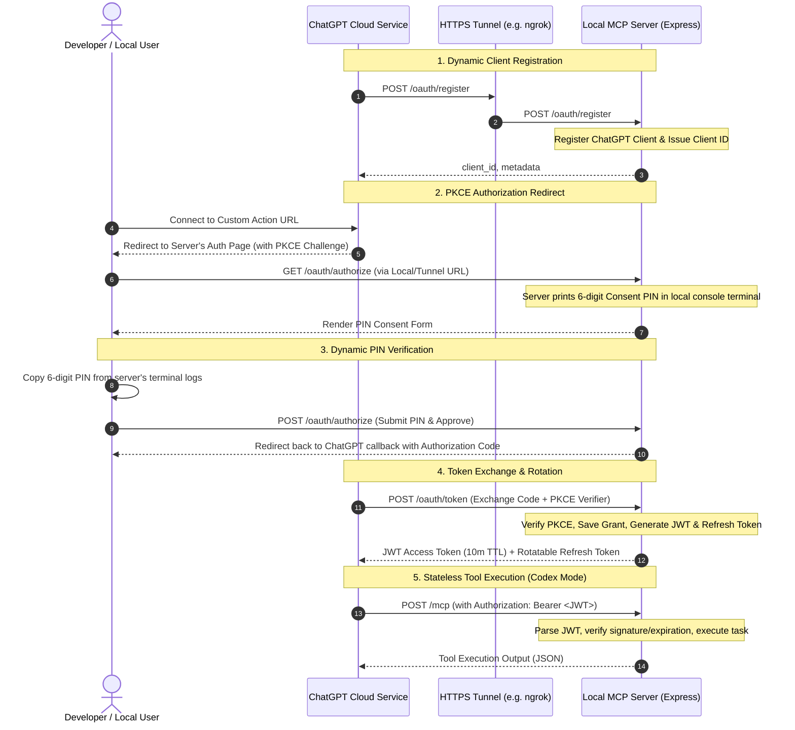

# Local Computer Control MCP Server

A hardened, production-ready **Model Context Protocol (MCP) server** that enables an authorized ChatGPT session to act as a **local "Codex" environment**, allowing it to securely control a Windows or macOS machine through terminal commands, filesystem operations, and process management.

The server is designed with a defense-in-depth security model to ensure that powerful local capabilities (which run with the permissions of the host user) are only accessible to an explicitly approved, authenticated, and revocable ChatGPT connection.



---

## 🔑 How It Works: The OAuth + MCP Flow

ChatGPT uses **OAuth 2.0 with PKCE (Proof Key for Code Exchange)** to securely authenticate and maintain connection persistence. The flow behaves as follows:



### 1. Registration & Setup
The server exposes an RFC 7591 compliant dynamic client registration endpoint (`/oauth/register`). ChatGPT registers itself, obtaining a unique client ID.

### 2. Authorization & The Local PIN Gate
To connect, ChatGPT redirects your browser to the authorization endpoint (`/oauth/authorize`). Instead of using static credentials, the server **dynamically generates a random 6-digit Consent PIN** and prints it to the local terminal. You must enter this PIN in the browser form to approve the connection. This ensures only someone with access to the host machine's terminal can grant access.

### 3. JWT-Based Stateless Tool Execution
Once authorized, ChatGPT obtains a short-lived JSON Web Token (JWT) access token (10-minute lifetime by default). Every MCP tool call is transmitted via stateless HTTP POST request to the `/mcp` endpoint and must include a valid bearer token.

### 4. Refresh Token Rotation (RTR)
When the access token expires, ChatGPT automatically uses the refresh token to request a new set of tokens. The server rotates refresh tokens upon use and supports **bounded parallel branch rotation** (up to 64 active keys per grant), ensuring concurrent ChatGPT queries do not accidentally invalidate each other.

---

## 🛠️ Included Tools

Once connected, ChatGPT can call the following tools to inspect, modify, and build local code:

*   **`terminal`**: Run shell and filesystem operations using PowerShell on Windows, `/bin/bash` on macOS, and `/bin/sh` on Linux.
    *   *Features*: Bounded output, a 60-second maximum timeout, and platform-aware process termination.
*   **`analyze_image`**: Load a local PNG, JPEG, WebP, or GIF and return it as native MCP image content so ChatGPT can visually inspect it.
    *   *Features*: Detects the image type from file bytes rather than trusting the extension and rejects images larger than 20 MiB.
*   **`save_chatgpt_file`**: Save a file already present in the ChatGPT conversation (including a ChatGPT-generated image) directly to a local path.
    *   *Features*: Uses ChatGPT `openai/fileParams`, bounded HTTPS downloads, redirect limits, optional parent-directory creation, and overwrite control.
*   **`start_process`**: Start an executable with strict argument-array semantics (no shell interpolation), optionally waiting for completion.
*   **`browser_tabs`**: List tabs from the user's real Chrome profile with ownership state.
*   **`browser_tab`**: Claim or release user tabs, mark handoffs or deliverables, and clean up agent-created tabs.
*   **`browser_open`**: Start Chrome if needed, wait for its extension, and open an agent-owned tab or window with automation attached.
*   **`browser_snapshot`**: Inspect a tab with visible text, fresh element refs, related popups, a compact accessibility tree, console/network diagnostics, and an optional PNG screenshot.
*   **`browser_action`**: Navigate, go back or forward, reload, click, double-click, type, press keys, scroll, wait, activate, or close a tab. Every action returns a fresh semantic snapshot.
*   **`browser_upload`**: Upload local files through a file input or intercepted browser file chooser.
*   **`browser_download`**: Trigger, list, wait for, or cancel downloads and report their local file paths.
*   **`browser_evaluate`**: Run JavaScript through CDP for development/debugging cases that structured browser actions cannot cover.

---

## 📦 Installation & Setup

### Prerequisites
*   **Node.js**: `v22.0.0` or higher (under `v23`).
*   **pnpm**: Version 9 or higher.
*   **PowerShell**: Windows PowerShell on Windows, or PowerShell 7 (`pwsh`) on macOS, for the included management scripts. MCP terminal commands use Bash on macOS.
*   **A Public Tunnel**: `ngrok`, `cloudflared`, or similar.

### Step 1: Install Dependencies
```powershell
pnpm install --frozen-lockfile
```

### Step 2: Configure Environment Variables
Create a `.env` file in the root directory. You can copy the template from `.env.example`:
```powershell
Copy-Item .env.example .env
```

Edit your `.env` file to match your setup:
```env
PORT=6000
HOST=localhost

# Chrome bridge stays loopback-only and is not sent through the public tunnel.
BROWSER_BRIDGE_ENABLED=true
# BROWSER_BRIDGE_PORT=6001 # defaults to PORT + 1

# Set these to your public HTTPS tunnel domain (e.g. ngrok or cloudflare tunnel)
PUBLIC_BASE_URL=https://mcp.yourtunnel.ngrok-free.app
MCP_PUBLIC_URL=https://mcp.yourtunnel.ngrok-free.app/mcp
AUTH_ISSUER=https://mcp.yourtunnel.ngrok-free.app

# Lockdown callback URIs to match ChatGPT (obtain this from your Custom Action registration page)
ALLOWED_REDIRECT_URIS=https://chatgpt.com/connector/oauth/your-unique-connector-id
REQUIRE_EXACT_REDIRECT_URIS=true

# Security defaults
ALLOW_NON_LOOPBACK_BIND=false
ACCESS_TOKEN_TTL_SECONDS=600
REFRESH_ROTATION_GRACE_SECONDS=60
MAX_REFRESH_TOKENS_PER_GRANT=64
# Optional management-script override; normally leave unset.
# POWERSHELL_EXECUTABLE=pwsh

# Optional MCP terminal override. macOS defaults to /bin/bash.
# TERMINAL_EXECUTABLE=/bin/bash
```

> [!IMPORTANT]  
> Because ChatGPT is a cloud-based service, it **cannot** talk to `localhost` directly. You must configure a tunnel (e.g. `ngrok http 6000`) and set the `PUBLIC_BASE_URL`, `MCP_PUBLIC_URL`, and `AUTH_ISSUER` variables to the tunnel's HTTPS URL.

### Step 3: Harden File Permissions
Run the hardening script to restrict access to the `.env` configuration file and `.data/` directory. On Windows it applies ACLs; on macOS it removes group and other permissions:
```powershell
pnpm run harden
```

### Step 4: Build and Start the Server
Build the TypeScript source and run the production server:
```powershell
pnpm run build
pnpm start
```
Alternatively, for development mode:
```powershell
pnpm dev
```

### Step 5: Load the Chrome bridge extension

The server creates a private unpacked extension at `.data/browser-extension` and prints the exact path at startup. The generated folder contains a loopback WebSocket address and a random 256-bit bridge token stored under `.data`; it is intentionally excluded from Git.

1. Open `chrome://extensions` in the Chrome profile you want ChatGPT to control.
2. Enable **Developer mode**.
3. Click **Load unpacked** and choose the generated `.data/browser-extension` directory.
4. The extension badge shows **ON** when it is connected to the local MCP server.

This is a one-time setup for that Chrome profile. The bridge talks only to `127.0.0.1`; the public HTTPS tunnel is used only for ChatGPT-to-MCP traffic.

### Automatic Chrome startup

Call `browser_open` with the desired URL. Browser operations start Chrome when the bridge is disconnected and wait up to 15 seconds after launch for the extension to connect. Concurrent requests share one launch attempt.

Chrome must be installed and the generated extension must be loaded once. If the extension is disabled or missing, the tool returns its setup path. It does not install extensions or bypass Chrome's setup permissions. The server finds Chrome in standard Windows, macOS, and Linux locations. For a different installation, set `BROWSER_EXECUTABLE_PATH` in `.env`.

Chrome normally opens its default startup profile. If your extension is in another profile, set `BROWSER_PROFILE_DIRECTORY` to its directory name, such as `Profile 1`. For a custom user data location, also set `BROWSER_USER_DATA_DIRECTORY`. An already connected browser is reused regardless of these launch settings.

### Tabs shared across tasks

`tabId` remains optional. Omit it to use the active tab in the last-focused window, or pass a tab ID to target a specific tab. Different tabs can run concurrently, including background tabs opened with `active: false`. Tasks can switch tabs or share the same tab. Existing user tabs still require a title-and-URL-checked claim before control.

All tasks share the profile and controlled-tab list. `browser_tab` with `action: "cleanup"` applies to all controlled tabs, not just one task's tabs. Close or release individual tabs when another task is still using the browser.

Controlled pages show the viewport aura, animated mouse pointer, and a mouse favicon. The site favicon is restored when control is released. There is no control pill on the page. After an extension update, restart the server to refresh `.data/browser-extension`, reload the extension in `chrome://extensions`, and reload existing pages to replace their content scripts. Chrome's own debugger notification is separate from the page indicators.

### ChatGPT support extension

The separate **Local Codex Support** extension handles three ChatGPT-specific features without using the browser-control extension: thread sync, RALF automation, and agent thread messaging. Thread sync keeps the existing `sync_current_thread` then `get_current_thread_url` flow and can stay enabled in both Chrome and Helium.

The extension popup has independent toggles for **Thread sync**, **RALF automation**, and **Agent thread messaging**. Enable the two automation features only in the browser you want Local Codex to drive. Commands are also claimed atomically by the server, so two enabled browser instances cannot execute the same command.

RALF registration is project-scoped and independent of thread sync. Add one or more ChatGPT project home URLs or project IDs under **RALF projects** in the extension popup. When ChatGPT enters a conversation inside one of those projects, including a thread created by `chatgpt_message`, the extension reports the saved `/g/<project-id>/c/<thread-id>` URL and the server registers it. Normal chats and projects not on the list are ignored. Named project home routes such as `/g/g-p-...-deepak/project` are canonicalized to the stable `g-p-...` project ID. After 25 minutes, RALF opens the saved thread in the enabled browser, waits for the hydrated conversation DOM to become stable, returns immediately if the stop button says the thread is still running, and otherwise reads ChatGPT's `Worked for ...` duration. RALF calls the OpenAI API only when that duration is greater than 19 minutes; shorter or unknown durations are treated as normal completion.

The `chatgpt_message` MCP tool uses the same support extension to start a new project thread or send a message to an existing conversation URL. Configure the browser's **Sub-agent project** once in the extension popup, then omit `targetUrl` when starting a new sub-agent. Existing conversation URLs and explicit project URLs can still be passed as targets. Bare `https://chatgpt.com/` new chats are rejected so sub-agents are always spawned under a project. It opens a background ChatGPT tab, waits for the composer and send state to settle, then performs a 30-second bounded send attempt. If the first click is ignored, it retries once only when the unchanged composer proves a duplicate send is safe, captures the resulting saved conversation URL, and closes the automation tab.

Four personal skills split the shipping workflow by responsibility. `implementer`
changes, tests, and inspects code, `file-pr` publishes the verified state,
`babysit-pr` owns CI and cross-thread coordination, and `reviewer` submits
the formal GitHub review. The two conversations exchange exact, versioned wakeup
prompts through explicitly targeted Chrome tabs for at most five rounds. No
skill merges the PR. The design record is in
[`docs/adr/0001-explicit-chatgpt-url-binding.md`](docs/adr/0001-explicit-chatgpt-url-binding.md).

Run `pnpm support:prepare` to generate `.data/support-extension` without starting a server or browser. On the first upgrade, remove the old **Local Codex Thread Sync** unpacked extension from Chrome/Helium before loading the new generated support extension. The support extension uses its own loopback HTTP listener on port 6002, configured with `THREAD_SYNC_PORT`; the MCP and Browser Bridge ports are unchanged. RALF also needs `OPENAI_API_KEY`. See [support-extension/README.md](support-extension/README.md) for installation and browser-toggle setup.

---

## 🔗 Connecting ChatGPT

1.  Create a new **Custom GPT** or **Custom Action** in ChatGPT.
2.  Add the MCP Schema metadata or set the import URL to:
    ```text
    https://your-tunnel-domain.ngrok-free.app/mcp
    ```
3.  Choose **OAuth** as the authentication type.
4.  Configure the OAuth details:
    *   **Client ID**: (Will be created dynamically during registration, or copy the values if using static options)
    *   **Authorization URL**: `https://your-tunnel-domain.ngrok-free.app/oauth/authorize`
    *   **Token URL**: `https://your-tunnel-domain.ngrok-free.app/oauth/token`
    *   **Scope**: `mcp:control`
5.  Trigger the auth flow in ChatGPT. Look at your local terminal console where the server is running to get your **6-digit Consent PIN**, input it on the webpage, and approve!

---

## 🛡️ Security Hardening Details

*   **🔒 Strict Binds**: The server binds to loopback (`localhost`) by default, preventing local network exposure unless `ALLOW_NON_LOOPBACK_BIND=true` is set.
*   **🔐 File Permission Isolation**: `pnpm run harden` applies Windows ACLs or macOS permissions to protect signing keys and token caches.
*   **🙅 Open Redirect Protection**: The server blocks dynamic client registrations from attempting open redirection. Redirect URIs must match exact registered patterns.
*   **⏳ Short-Lived JWTs**: Access tokens expire in 10 minutes. Token validity is checked against a cryptographic signature (RS256) on every MCP request.
*   **🌀 Hash-based Token Storage**: Refresh tokens are stored in the database as SHA-256 hashes rather than plaintext.
*   **🚫 Sandboxed Child Processes**: Launched commands and child processes do not inherit sensitive environment variables like authorization credentials.
*   **📈 Rate Limiting**: Protection against brute-force attempts on critical endpoints (token exchange, authorization code creation, and client registration).
*   **Browser Bridge Isolation**: Chrome connects only to a loopback WebSocket protected by a random token stored in `.data`. The extension never connects to the public MCP tunnel.
*   **Visible Browser Control**: Controlled tabs show a blue viewport aura, an animated click pointer, and a mouse favicon. The overlay cannot receive input; release removes it and restores the site favicon.
*   **Stale Element Protection**: Browser element refs are scoped to the latest snapshot and page epoch. Navigation or document changes invalidate old refs instead of clicking a recycled target.
*   **Semantic Browser State**: Automation prefers Playwright locator semantics plus Chrome's accessibility tree. Coordinates are only a fallback for visual/canvas targets.
*   **Tab Ownership**: Existing user tabs require a fresh title-and-URL-checked claim. Popups inherit agent ownership from their opener. Cleanup closes unmarked agent tabs and releases unmarked user tabs without closing them.

---

## 🧹 Managing and Revoking Access

To audit, list, or revoke registered clients and active OAuth grants:

```powershell
# Interactive list of clients and grants
pnpm revoke

# Revoke all grants for a specific client
pnpm revoke -- -ClientId local_example

# Revoke all grants and logouts
pnpm revoke -- -All

# Remove client registrations alongside grants
pnpm revoke -- -All -RemoveClients
```

---

## 🧪 Testing & Verification

### Smoke Test
Verify PKCE authentication, client registration, access token expiration, token rotation, and tools behavior on a running instance. The script prompts for the per-request consent PIN printed by the running server:
```powershell
pnpm smoke
```

### Security Regression Suite
Ensure the server maintains security boundaries, prevents open redirects, respects CORS boundaries, and properly authenticates request payloads:
```powershell
pnpm security-test
```

## 📄 License
This project is licensed under the [MIT License](LICENSE).
