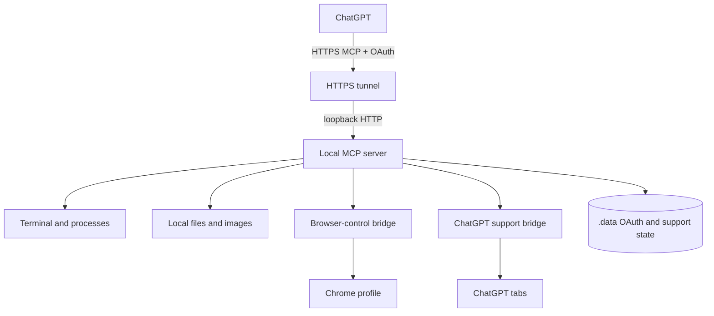
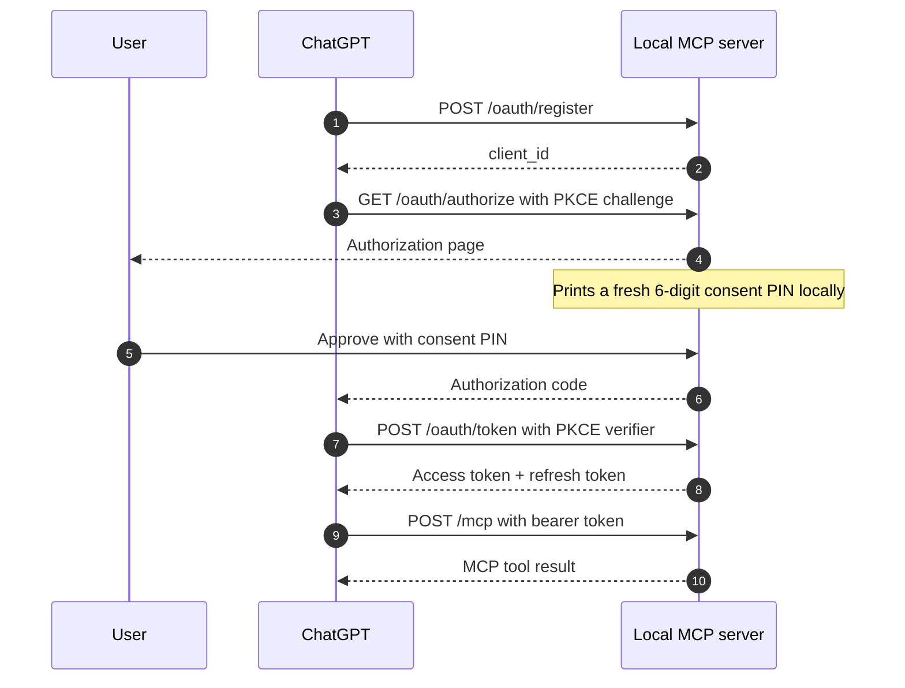

# Local Computer Control MCP Server

Local Computer Control is a local Model Context Protocol server that lets an authorized ChatGPT session operate a developer machine. It exposes terminal, process, file, image, browser, thread-sync, sub-agent, and RALPH capabilities while keeping the MCP server and browser bridges under the local user's control.

The server is designed for powerful local automation. Tool calls run with the permissions of the user who started the server, so access is protected by OAuth, a local consent PIN, loopback-only defaults, scoped browser bridges, and revocable grants.



## What the server provides

### Local computer tools

The core MCP server always exposes these tools:

- `terminal` runs one shell command. The default shell is PowerShell on Windows, `/bin/bash` on macOS, and `/bin/sh` on Linux. Calls have a 60-second maximum timeout.
- `analyze_image` reads a local PNG, JPEG, WebP, or GIF and returns native MCP image content. Images are limited to 20 MiB.
- `save_chatgpt_file` saves a file already present in the ChatGPT conversation to the local filesystem. Downloads are bounded by size, timeout, and redirect limits.
- `start_process` starts an executable with an argument array instead of shell interpolation. It can return immediately or wait up to 60 seconds for completion.

### Browser-control tools

When `BROWSER_BRIDGE_ENABLED` is not `false`, the server also exposes:

- `browser_tabs` lists tabs in the user's real Chrome profile.
- `browser_claim` takes control of one existing user tab after checking its tab ID, title, and URL.
- `browser_release` ends control. It closes an agent-created tab and leaves a claimed user tab open.
- `browser_open` opens and controls a new tab or window and can start Chrome when the bridge is disconnected.
- `browser_snapshot` returns visible text, fresh element references, accessibility information, diagnostics, and an optional screenshot.
- `browser_action` navigates, clicks, types, presses keys, scrolls, waits, activates, reloads, or closes a controlled tab.
- `browser_upload` uploads local files through a file input or intercepted file chooser.
- `browser_download` triggers, lists, waits for, or cancels browser downloads.
- `browser_evaluate` evaluates JavaScript through CDP for development and debugging cases where structured actions are not enough.

A normal browser workflow is `browser_open`, or `browser_tabs` followed by `browser_claim`, then `browser_snapshot` and actions, and finally `browser_release`.

### ChatGPT thread and sub-agent tools

When `THREAD_SYNC_ENABLED` is not `false`, the server also exposes:

- `sync_current_thread` performs the one-time binding between the current `openai/session` and its ChatGPT conversation. Repeated calls return the saved URL without another handshake.
- `get_current_thread_url` waits for the initial binding when `sync_current_thread` reports `syncing`. It never guesses or constructs a conversation URL.
- `start_subagent` starts a separate ChatGPT child conversation and creates a local result job. The parent must already be synced. Transport retries of the same MCP request are deduplicated internally.
- `submit_subagent_result` stores the child report in the local result file for that job. It does not send the report through ChatGPT.
- `send_thread_message` sends one explicit user-requested message to an existing ChatGPT conversation. Its public inputs are only `targetUrl` and `message`; transport retries of the same MCP request are deduplicated internally.
- `list_subagents` shows the children created by the current synced parent, including their title, RALPH state, and local result status.

`start_subagent` uses the Sub-agent project configured in the Local Codex Support extension settings. If no project is configured, it starts from `https://chatgpt.com/`. The server gives the child a local job ID and result path. The child finishes with `submit_subagent_result`. The backend then sends the parent a short result-ready wake-up that points to the file. The parent reads the local file for the actual report.

## OAuth and MCP flow

ChatGPT authenticates with OAuth 2.0 and PKCE. The server uses stateless MCP HTTP requests, so every `/mcp` request must carry a valid access token.



The default access-token lifetime is 600 seconds. Refresh tokens rotate on use. The server keeps a bounded set of parallel refresh-token branches per grant so concurrent ChatGPT requests do not invalidate each other unnecessarily.

## Install and configure

### Prerequisites

- Node.js 24 or newer is recommended. The repository intentionally has no `.nvmrc` or `engines` major-version pin.
- pnpm 11.8.0 is the package-manager version declared by `package.json`.
- PowerShell is required for the included management scripts. On macOS and Linux, use `pwsh` for those scripts.
- A public HTTPS tunnel such as ngrok or Cloudflare Tunnel is required when ChatGPT needs to reach the local MCP endpoint.
- Google Chrome is required for the general browser-control bridge.

### Install dependencies

```powershell
pnpm install --frozen-lockfile
```

### Create `.env`

```powershell
Copy-Item .env.example .env
```

The main settings are:

```env
PORT=6000
HOST=localhost

PUBLIC_BASE_URL=https://mcp.example.com
MCP_PUBLIC_URL=https://mcp.example.com/mcp
AUTH_ISSUER=https://mcp.example.com

ALLOWED_REDIRECT_URIS=https://chatgpt.com/connector/oauth/your-connector-id
REQUIRE_EXACT_REDIRECT_URIS=true
ALLOW_NON_LOOPBACK_BIND=false

BROWSER_BRIDGE_ENABLED=true
# BROWSER_BRIDGE_PORT=6001

THREAD_SYNC_ENABLED=true
# THREAD_SYNC_PORT=6002

# Required only when normal RALPH classification is used.
OPENAI_API_KEY=
# RALPH_MODEL=gpt-5.6-terra
```

Use `.env.example` as the complete reference. It also documents file-download limits, OAuth storage, terminal overrides, browser executable and profile overrides, token settings, and CORS settings.

`PUBLIC_BASE_URL`, `MCP_PUBLIC_URL`, and `AUTH_ISSUER` must use the same origin. For a public deployment with exact redirect matching enabled, `ALLOWED_REDIRECT_URIS` must contain the exact ChatGPT OAuth callback URI.

Keep `HOST` on loopback. A public tunnel should forward to the local listener instead of exposing the Node process directly.

### Harden local state

```powershell
pnpm harden
```

The hardening script restricts access to `.env` and `.data`. On Windows it applies ACLs. On macOS and Linux it uses the available PowerShell management path and filesystem permissions.

### Build and start

```powershell
pnpm build
pnpm start
```

For development:

```powershell
pnpm dev
```

## Set up browser control

The server generates a private unpacked extension under `.data/browser-extension`. The generated copy contains the loopback bridge endpoint and a random bridge token, so do not load the source `browser-extension` directory directly.

1. Start Local Computer Control once so `.data/browser-extension` exists.
2. Open `chrome://extensions` in the Chrome profile that ChatGPT should control.
3. Enable **Developer mode**.
4. Click **Load unpacked** and select `.data/browser-extension`.
5. Confirm that the extension connects to the local bridge.

The browser bridge listens only on loopback. It is separate from the public MCP listener.

`browser_open` can start Chrome when the bridge is disconnected. The extension must already be installed in the profile that Chrome opens. Use `BROWSER_EXECUTABLE_PATH`, `BROWSER_PROFILE_DIRECTORY`, and `BROWSER_USER_DATA_DIRECTORY` when the default installation or profile is not the one you want.

Controlled pages show visible control indicators. Element references returned by `browser_snapshot` are valid only for the latest page state. Navigation or document changes invalidate stale references.

## Set up the Local Codex Support extension

The support extension is separate from the general browser-control extension. It handles Thread Sync, RALPH, and agent thread messaging.

Generate the private extension:

```powershell
pnpm support:prepare
```

This writes `.data/support-extension` with the local support endpoint and private token. The support listener defaults to `127.0.0.1:6002`. Set `THREAD_SYNC_PORT` to change it or `THREAD_SYNC_ENABLED=false` to disable the feature.

Load `.data/support-extension` as an unpacked extension. Do not load the source `support-extension` directory.

The popup lets you configure four browser responsibilities:

- Thread sync. This can be enabled in more than one compatible browser because binding is idempotent.
- Thread preparation executor. Enable this only in the Chrome automation profile. It owns parked tabs for unsynced threads.
- RALPH automation. Normally enable this in only one browser.
- Agent thread messaging. Normally enable this in only one browser.

Automation commands are claimed atomically by one enabled browser instance. This prevents two support extensions from executing the same queued command.

See [support-extension/README.md](support-extension/README.md) for the exact support-extension behavior.

## Sub-agent result delivery

Call `sync_current_thread` once at the start of the parent conversation. If it reports `syncing`, finish the initial handshake with `get_current_thread_url`. Later `sync_current_thread` calls return the stored URL and do not start another handshake.

`start_subagent` creates a job under `<DATA_DIR>/subagents/`. The child receives the job ID and result path, not the parent URL. Before reporting startup success, the backend confirms that the child's parked Thread Sync tab was prepared. If automatic preparation fails after the child was already created, the tool returns the child and result path with the preparation error instead of retrying into a duplicate child. When the child finishes, `submit_subagent_result` writes the report to the assigned `.md` file. The backend sends the parent only a result-ready message with that path. Parent wake-up failures use exponential backoff and stop after five failed attempts, with the error retained in the sub-agent status. The parent reads the file as the authoritative result.

The browser path is still used to create the child and to wake the parent. It uses the existing single-send behavior: wait for the page, insert once, and click Send once. The sub-agent report itself does not travel through browser messaging.

`start_subagent` and `send_thread_message` keep transport idempotency internal. The server deduplicates retries of the same MCP request by tool, request identity, session, and payload fingerprint. `send_thread_message` also fingerprints its normalized target. A new logical tool call remains a new send or a new child.

## RALPH

RALPH is the support-extension continuation runtime. It tracks registered ChatGPT threads in `.data/ralph.json` and shows them in the support-extension popup.

Normal project threads are registered only when their project is in the RALPH project allowlist. Manually registered threads and agent-created sub-agents remain registered independently of that allowlist.

Thread preparation is independent from RALPH registration. Every observed unsynced ChatGPT `/c/...` route is sent to the local backend. The backend starts Chrome when no recent preparation executor is connected and queues one `prepare_thread`. The Chrome profile with **Thread preparation executor** enabled opens parked background tabs, with at most three preparations active at once. A successful preparation is attempted only once per thread during that server run, and a successful one-time Thread Sync handshake closes the tab early. Already-synced threads do not open another preparation tab.

RALPH has two modes:

- `normal` uses the worked-duration gate and the OpenAI completion classifier. The first check defaults to 1500 seconds after registration or reactivation, and later checks use a 300-second interval. The default minimum reported work duration is 1140 seconds.
- `continuous` is explicit. It skips completion classification and sends a fixed continuation instruction whenever the thread is idle and due. It stays active until the user stops continuous mode or marks the thread complete.

Normal-mode classification uses `OPENAI_API_KEY` and defaults to `gpt-5.6-terra`. Classification requests and results are written to `.data/ralph-openai.log`; the API key is not written to that log.

## Connect ChatGPT

Expose the local MCP listener through an HTTPS tunnel, then configure the ChatGPT connector to use:

- MCP URL: `https://your-domain.example/mcp`
- Authorization URL: `https://your-domain.example/oauth/authorize`
- Token URL: `https://your-domain.example/oauth/token`
- Scope: `mcp:control`, unless `REQUIRED_SCOPE` is changed

During authorization, read the fresh six-digit consent PIN from the local server terminal and enter it in the authorization page.

## Security model

The important boundaries are:

- The main server binds to loopback unless `ALLOW_NON_LOOPBACK_BIND=true` is set.
- OAuth uses PKCE and a fresh local six-digit consent PIN for each authorization request.
- Access tokens are short-lived. Refresh tokens rotate, and stored refresh tokens are hashed.
- Public deployments can require exact OAuth redirect URIs.
- The browser-control bridge and ChatGPT support bridge use separate private loopback credentials stored under `.data`.
- Browser tab ownership is explicit. Existing tabs must be claimed from a fresh `browser_tabs` listing.
- Browser element references become stale when the page state changes.
- `start_process` executes an executable directly instead of interpolating a shell command.
- Child processes are launched with a restricted environment rather than inheriting authentication secrets.
- Rate limits protect sensitive OAuth and support endpoints.

Treat `.env` and `.data` as private host state.

## Revoke access

Run the interactive revocation tool:

```powershell
pnpm revoke
```

Examples:

```powershell
pnpm revoke -- -ClientId local_example
pnpm revoke -- -All
pnpm revoke -- -All -RemoveClients
```

## Verification

Type-check the project:

```powershell
pnpm check
```

Run the OAuth and tool smoke test against a running instance:

```powershell
pnpm smoke
```

Run the security regression suite:

```powershell
pnpm security-test
```

Run browser bridge tests:

```powershell
pnpm browser-test
```

Run Thread Sync, support extension, sub-agent, and RALPH tests:

```powershell
pnpm thread-sync-test
```

## Design docs

- [Local Codex Support extension](support-extension/README.md)
- [ADR 0001: explicit ChatGPT URL binding and support automation](docs/adr/0001-explicit-chatgpt-url-binding.md)

## License

`package.json` declares the project license as MIT.
