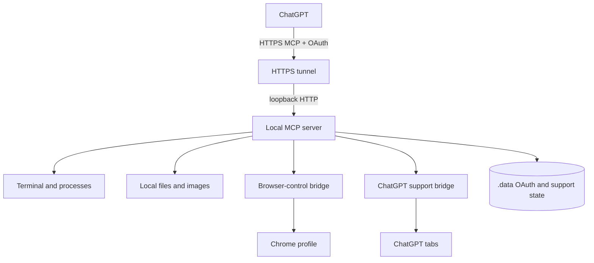
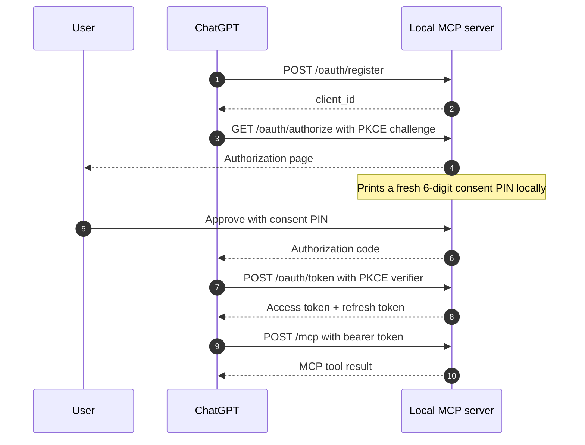

# Local Computer Control MCP Server

Local Computer Control is a local Model Context Protocol server that lets an authorized ChatGPT session operate a developer machine. It exposes terminal, process, file, image, browser, thread-sync and bounded task delegation while keeping the MCP server and browser bridges under the local user's control.

The server is designed for powerful local automation. Tool calls run with the permissions of the user who started the server, so access is protected by OAuth, a local consent PIN, loopback-only defaults, scoped browser bridges, and revocable grants.


```mermaid
graph TD
    GPT[ChatGPT] -->|HTTPS MCP + OAuth| Tunnel[HTTPS tunnel]
    Tunnel -->|loopback HTTP| Server[Local MCP server]

    Server --> Terminal[Terminal and processes]
    Server --> Files[Local files and images]
    Server --> BrowserBridge[Browser-control bridge]
    Server --> SupportBridge[ChatGPT support bridge]

    BrowserBridge --> Chrome[Chrome profile]
    SupportBridge --> ChatGPTTabs[ChatGPT tabs]

    Server --> Store[(.data OAuth and support state)]
```

## What the server provides

For a local parent agent, use `pnpm agent run --file spec.md`. Keep the command alive until it returns the report. The CLI supplies caller grouping and a request ID. See [the delegation workflow](docs/delegation.md) and [the API reference](docs/agent-api-reference.md).

To control Voice in a dedicated chatgpt.com conversation, follow [the browser Voice setup](docs/browser-voice-controls.md). The local CLI can configure the saved chat, inspect its call controls, start Voice, and end the call.

### Local computer tools

The core MCP server always exposes these tools:

- `terminal` runs one shell command. The default shell is PowerShell on Windows, `/bin/bash` on macOS, and `/bin/sh` on Linux. Calls have a 60-second maximum timeout.
- `analyze_image` reads a local PNG, JPEG, WebP, or GIF and returns native MCP image content. Images are limited to 20 MiB.
- `save_chatgpt_file` saves a file already present in the ChatGPT conversation to the local filesystem. Downloads are bounded by size, timeout, and redirect limits.
- `start_process` starts an executable with an argument array instead of shell interpolation. It can return immediately or wait up to 60 seconds for completion.

### Browser-control tools

When `BROWSER_BRIDGE_ENABLED` is not `false`, the server also exposes:

- `browser_tabs` lists tabs in the user's real Chrome profile.
- `browser_claim` takes control of one existing user tab after checking its tab ID, title, and URL.
- `browser_release` ends control. It closes an agent-created tab and leaves a claimed user tab open.
- `browser_open` opens and controls a new tab or an explicitly requested window in Chrome. It starts Chrome when needed and reuses a running browser.
- `browser_snapshot` returns visible text, fresh element references, accessibility information, diagnostics, and an optional screenshot.
- `browser_action` navigates, clicks, types, presses keys, scrolls, waits, activates, reloads, or closes a controlled tab.
- `browser_upload` uploads local files through a file input or intercepted file chooser.
- `browser_download` triggers, lists, waits for, or cancels browser downloads.
- `browser_evaluate` evaluates JavaScript through CDP for development and debugging cases where structured actions are not enough.

A normal browser workflow is `browser_open`, or `browser_tabs` followed by `browser_claim`, then `browser_snapshot` and actions, and finally `browser_release`.

### ChatGPT thread tools

When `THREAD_SYNC_ENABLED` is not `false`, the server exposes:

- `sync_current_thread` binds the ChatGPT conversation identifier supplied in request metadata to its URL once.
- `get_current_thread_url` finishes a pending binding.
- `start_thread` creates a standalone conversation on explicit user request. It adds no task or callback.
- `send_thread_message` sends an explicitly requested message to an existing conversation.

Local agents delegate through [the blocking CLI or HTTP API](docs/agent-api.md). The request waits for the report. Include the revision in the specification. The CLI supplies a unique request ID, and retries with that ID reuse the saved job. Each caller group supports two pending assignments. The local caller requires no ChatGPT conversation binding.

State, specifications, and reports live under `<DATA_DIR>/tasks`. Legacy reviews and subagents migrate on first open. Workers use temporary chats. Cancellation and uncertain-delivery recovery remain operator actions in the Support extension.

## OAuth and MCP flow

ChatGPT authenticates with OAuth 2.0 and PKCE. The server uses stateless MCP HTTP requests, so every `/mcp` request must carry a valid access token.

The server implements [MCP 2026-07-28](https://modelcontextprotocol.io/specification/2026-07-28/basic/transports/streamable-http) with SDK v2. Each request carries `io.modelcontextprotocol/protocolVersion`, `io.modelcontextprotocol/clientInfo`, and `io.modelcontextprotocol/clientCapabilities` in `params._meta`. HTTP headers mirror the protocol version, method, and tool name. Clients can call tools without initialization. `server/discover` returns server information and instructions. The server creates a fresh MCP server for each request, issues no `Mcp-Session-Id`, and accepts only POST on `/mcp`.

The SDK also accepts stateless requests from supported 2025 clients so existing ChatGPT connectors can keep working. OAuth grants, conversation bindings, and saved task reports are application data. They do not create MCP transport sessions.


```mermaid
sequenceDiagram
    autonumber
    participant User
    participant GPT as ChatGPT
    participant Server as Local MCP server

    GPT->>Server: POST /oauth/register
    Server-->>GPT: client_id
    GPT->>Server: GET /oauth/authorize with PKCE challenge
    Server-->>User: Authorization page
    Note over Server: Prints a fresh 6-digit consent PIN locally
    User->>Server: Approve with consent PIN
    Server-->>GPT: Authorization code
    GPT->>Server: POST /oauth/token with PKCE verifier
    Server-->>GPT: Access token + refresh token
    GPT->>Server: POST /mcp with bearer token
    Server-->>GPT: MCP tool result
```

The default access-token lifetime is 600 seconds. Refresh tokens rotate on use. The server keeps a bounded set of parallel refresh-token branches per grant so concurrent ChatGPT requests do not invalidate each other unnecessarily.

## Install and configure

### Prerequisites

- Node.js 24 or newer is recommended. The repository intentionally has no `.nvmrc` or `engines` major-version pin.
- pnpm 11.8.0 is the package-manager version declared by `package.json`.
- PowerShell is required for the included management scripts. On macOS and Linux, use `pwsh` for those scripts.
- A public HTTPS tunnel such as ngrok or Cloudflare Tunnel is required when ChatGPT needs to reach the local MCP endpoint.
- Google Chrome is required for the general browser-control bridge.

### Install dependencies

```powershell
pnpm install --frozen-lockfile
```

### Create `.env`

```powershell
Copy-Item .env.example .env
```

The main settings are:

```env
PORT=6000
HOST=localhost

PUBLIC_BASE_URL=https://mcp.example.com
MCP_PUBLIC_URL=https://mcp.example.com/mcp
AUTH_ISSUER=https://mcp.example.com

ALLOWED_REDIRECT_URIS=https://chatgpt.com/connector/oauth/your-connector-id
REQUIRE_EXACT_REDIRECT_URIS=true
ALLOW_NON_LOOPBACK_BIND=false

BROWSER_BRIDGE_ENABLED=true
# BROWSER_BRIDGE_PORT=6001

THREAD_SYNC_ENABLED=true
# THREAD_SYNC_PORT=6002

# Marked manual-thread continuation is enabled by default.
RALPH_ENABLED=true
# Required only for the marked manual-thread continuation classifier.
OPENAI_API_KEY=
# RALPH_MODEL=gpt-5.6-terra
```

Use `.env.example` as the complete reference. It also documents file-download limits, OAuth storage, terminal overrides, browser executable and profile overrides, token settings, and CORS settings.

`PUBLIC_BASE_URL`, `MCP_PUBLIC_URL`, and `AUTH_ISSUER` must use the same origin. For a public deployment with exact redirect matching enabled, `ALLOWED_REDIRECT_URIS` must contain the exact ChatGPT OAuth callback URI.

Keep `HOST` on loopback. A public tunnel should forward to the local listener instead of exposing the Node process directly.

### Harden local state

```powershell
pnpm harden
```

The hardening script restricts access to `.env` and `.data`. On Windows it applies ACLs. On macOS and Linux it uses the available PowerShell management path and filesystem permissions.

### Build and start

```powershell
pnpm build
pnpm start
```

For development:

```powershell
pnpm dev
```

## Set up browser control

The server generates a private unpacked extension under `.data/browser-extension`. The generated copy contains the loopback bridge endpoint and a random bridge token, so do not load the source `browser-extension` directory directly.

1. Start Local Computer Control once so `.data/browser-extension` exists.
2. Open `chrome://extensions` in the Chrome profile that ChatGPT should control.
3. Enable **Developer mode**.
4. Click **Load unpacked** and select `.data/browser-extension`.
5. Confirm that the extension connects to the local bridge.

The browser bridge listens only on loopback. It is separate from the public MCP listener.

Install the browser-control extension in the configured Chrome profile. Browser tools reuse connected Chrome and start it when closed. If Chrome is running but its extension is disconnected, the server waits for that connection and reports a setup error without launching another instance.

Controlled pages show visible control indicators. Element references returned by `browser_snapshot` are valid only for the latest page state. Navigation or document changes invalidate stale references.

## Set up the Local Codex Support extension

The support extension is separate from the general browser-control extension. It handles Thread Sync, RALPH, and agent thread messaging.

Generate the private extension:

```powershell
pnpm support:prepare
```

This writes `.data/support-extension` with the local support endpoint and private token. The support listener defaults to `127.0.0.1:6002`. Set `THREAD_SYNC_PORT` to change it or `THREAD_SYNC_ENABLED=false` to disable the feature.

Load `.data/support-extension` as an unpacked extension. Do not load the source `support-extension` directory.

The sidebar configures these browser responsibilities:

- Thread sync. This can be enabled in more than one compatible browser because binding is idempotent.
- Automation browser executor. Enable this only in the Chrome automation profile. It opens or reuses persistent thread tabs for active registered conversations.
- RALPH automation for marked manual threads, visible when the server enables it.
- Agent thread messaging. Normally enable this in only one browser.

Automation commands are claimed atomically by one enabled browser instance. This prevents two support extensions from executing the same queued command.

See [support-extension/README.md](support-extension/README.md) for the exact support-extension behavior.

## Task result delivery

Workers write their complete report to the supplied temporary file and rename it to the final report path. The server watches the directory, persists completion, and returns the report through the waiting request. It collects reports published during downtime when it restarts. There are no completion tools, parent wake-up messages, or scheduled callbacks.

Safe failures before Send use bounded retry. Uncertain delivery after Send requires operator inspection. The Support extension shows saved errors and offers recovery controls. Recognized rate limits defer queued sends, while Stop remains available.

The service checks unfinished workers every 30 minutes without classifier calls. It waits while a worker runs and resumes an idle worker until the worker publishes its report. Report collection releases the waiting parent and closes the owned worker tab. A chat answer alone never marks an assignment complete.

## Automatic continuation

`RALPH_ENABLED` defaults to true and controls continuation of marked manual threads. Worker recovery uses task messaging and needs no classifier API key. The default interval is 1800 seconds. Observing an ordinary manual conversation updates its sidebar status without enabling continuation.

The extension detects the visible "Connection interrupted. Waiting for the complete answer" notice. For saved, managed threads, it refreshes up to three times, 30 seconds apart. For temporary task chats, it checks at the same interval without refreshing because a refresh discards the conversation. If the notice persists after all three checks, it stops the stuck turn and sends one continuation message. A turn that finishes before Stop receives no recovery message.

## Windows startup

After building and configuring the server, install the sign-in shortcut:

```powershell
	powershell.exe -NoProfile -ExecutionPolicy Bypass -File scripts/install-startup.ps1 -TunnelName local
```

The shortcut starts a hidden supervisor at user sign-in. It starts Chrome when needed, reuses a healthy MCP server and the configured Cloudflare tunnel, and restarts exited processes. A named mutex prevents duplicate supervisors. Logs live in `.data/runtime`. The tunnel must already have credentials and ingress configuration. ChatGPT and both generated extensions still need their existing signed-in browser profile.

## Connect ChatGPT

Expose the local MCP listener through an HTTPS tunnel, then configure the ChatGPT connector to use:

- MCP URL: `https://your-domain.example/mcp`
- Authorization URL: `https://your-domain.example/oauth/authorize`
- Token URL: `https://your-domain.example/oauth/token`
- Scope: `mcp:control`, unless `REQUIRED_SCOPE` is changed

During authorization, read the fresh six-digit consent PIN from the local server terminal and enter it in the authorization page.

## Security model

The important boundaries are:

- The main server binds to loopback unless `ALLOW_NON_LOOPBACK_BIND=true` is set.
- OAuth uses PKCE and a fresh local six-digit consent PIN for each authorization request.
- Access tokens are short-lived. Refresh tokens rotate, and stored refresh tokens are hashed.
- Public deployments can require exact OAuth redirect URIs.
- The browser-control bridge and ChatGPT support bridge use separate private loopback credentials stored under `.data`.
- Browser tab ownership is explicit. Existing tabs must be claimed from a fresh `browser_tabs` listing.
- Browser element references become stale when the page state changes.
- `start_process` executes an executable directly instead of interpolating a shell command.
- Child processes are launched with a restricted environment rather than inheriting authentication secrets.
- Rate limits protect sensitive OAuth and support endpoints.

Treat `.env` and `.data` as private host state.

## Revoke access

Run the interactive revocation tool:

```powershell
pnpm revoke
```

Examples:

```powershell
pnpm revoke -- -ClientId local_example
pnpm revoke -- -All
pnpm revoke -- -All -RemoveClients
```

## Verification

Type-check the project:

```powershell
pnpm check
```

Run the OAuth and tool smoke test against a running instance:

```powershell
pnpm smoke
```

Run the security regression suite:

```powershell
pnpm security-test
```

Run browser bridge tests:

```powershell
pnpm browser-test
```

Run Thread Sync, support extension, reviewer, and RALPH tests:

```powershell
pnpm thread-sync-test
```

## Design docs

- [Blocking local delegation](docs/adr/0002-bounded-task-delegation.md)

- [Local Codex Support extension](support-extension/README.md)
- [ADR 0001: explicit ChatGPT URL binding and support automation](docs/adr/0001-explicit-chatgpt-url-binding.md)

## License

`package.json` declares the project license as MIT.


## Agent instructions

Repository agents follow [AGENTS.md](AGENTS.md) and [the delegation workflow](docs/delegation.md). Local parents call the blocking CLI and read the returned report. Workers publish reports through a file rename. Install the same delegation instructions in the shared agent files with `node scripts/install-agent-instructions.mjs`.

## Connector configuration in Codex

Codex supports a local setting for an individual connector in `~/.codex/config.toml`. This setting controls Codex without disconnecting the connector in ChatGPT. See the [OpenAI configuration reference](https://learn.chatgpt.com/docs/config-file/config-reference).

For this installation, the connector ID is `asdk_app_6a87f9c260088191a43c50e76d4e03d7`:

```toml
	[apps.asdk_app_6a87f9c260088191a43c50e76d4e03d7]
	enabled = false
```

An existing conversation may retain previously loaded tool metadata. Start a new Codex conversation after changing the setting. The MCP endpoint also rejects requests whose client metadata identifies Codex. Connector setup and browser extensions belong to the service and worker environment. Local CLI callers need neither a browser extension nor a conversation binding.
